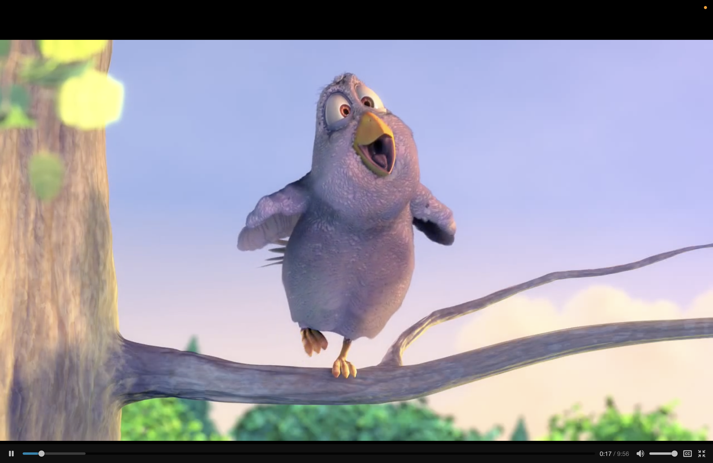
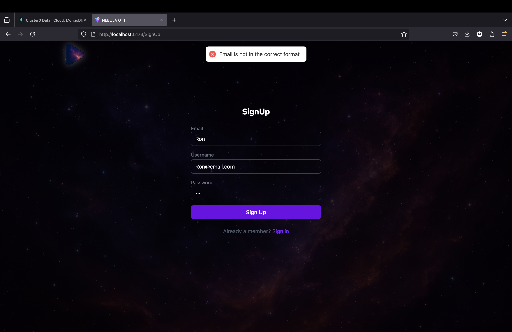
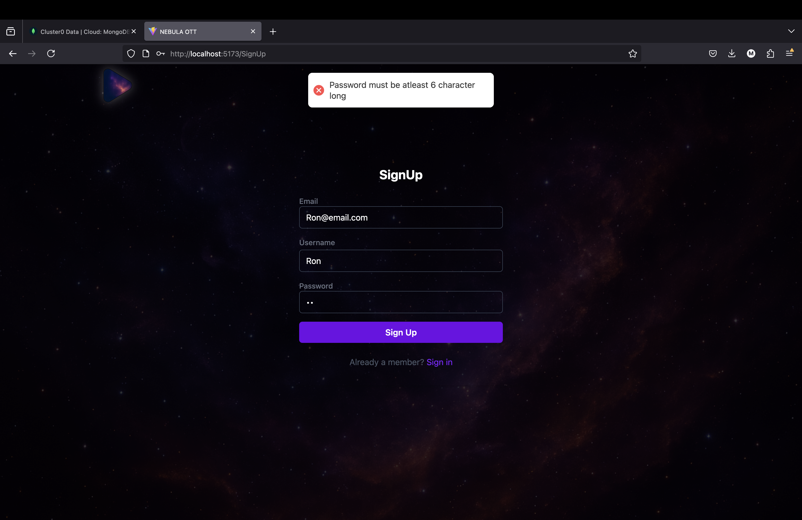
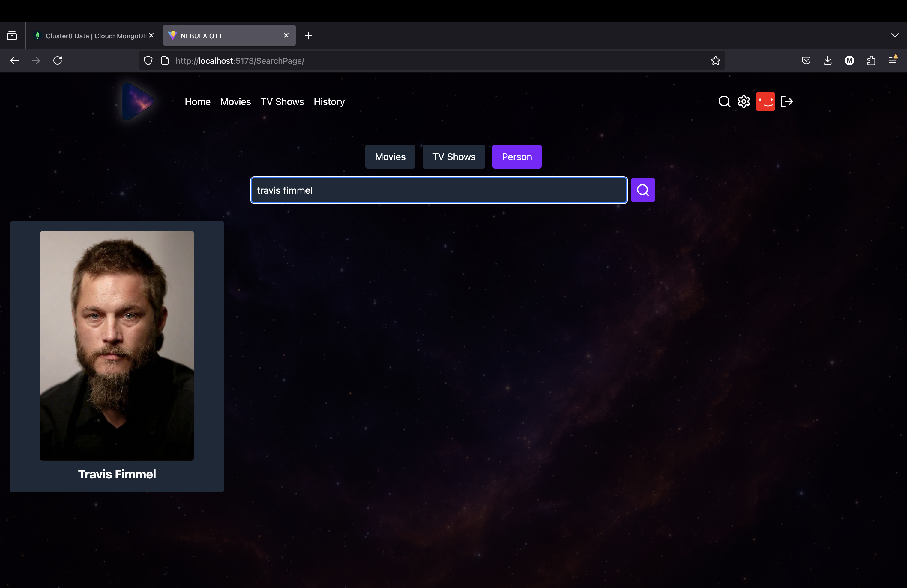
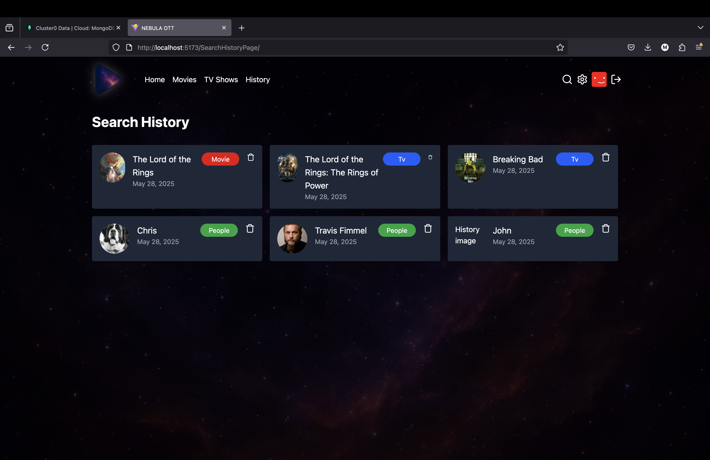
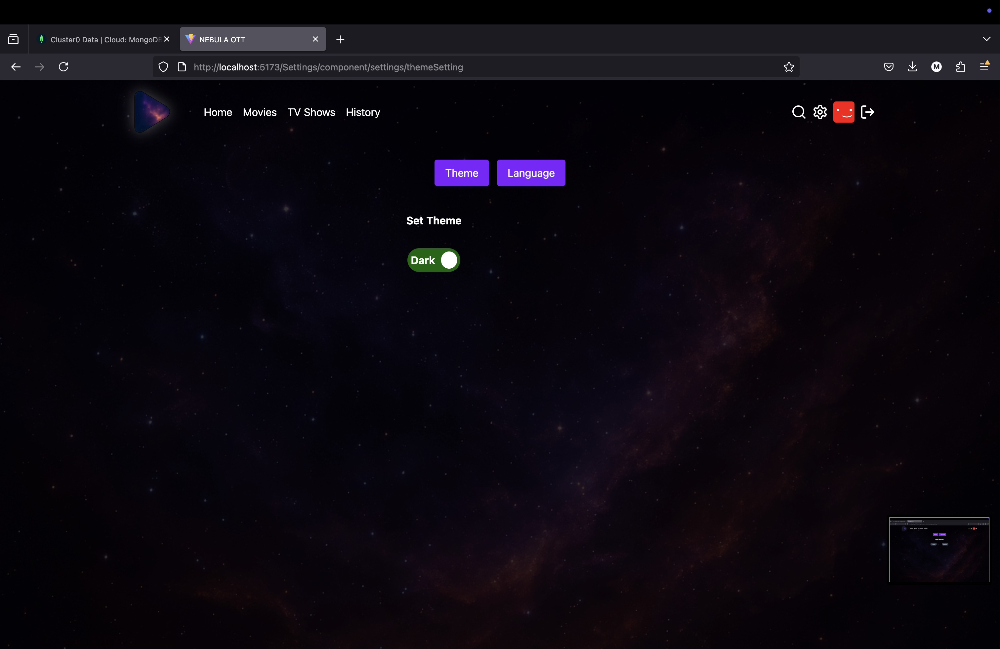
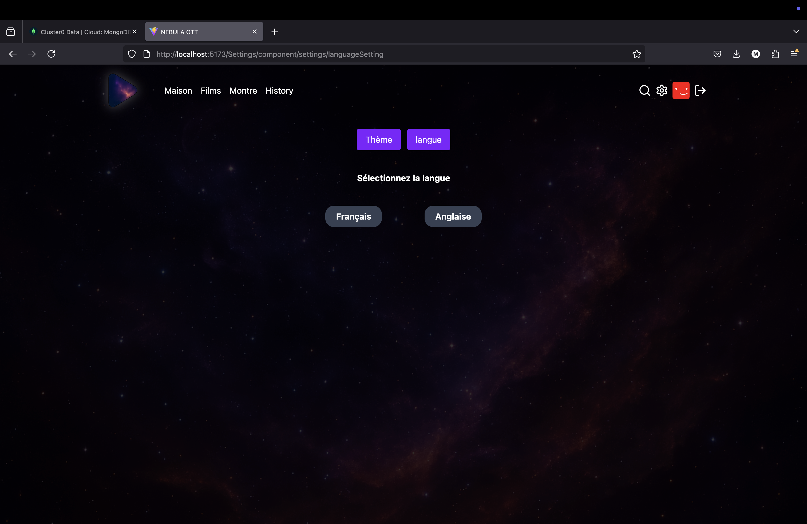

# Nebula-OTT
Nebula, an OTT app built using react.js

Home:

TV Shows:

Movies:

swimlanes:

details page:

trailer:

player screen:

Login screen:

Email validation:

password screen:

Person search:

Movies search:

TV show search:

Search history:

Dark Theme:

Light Theme:

English UI :

French UI:

